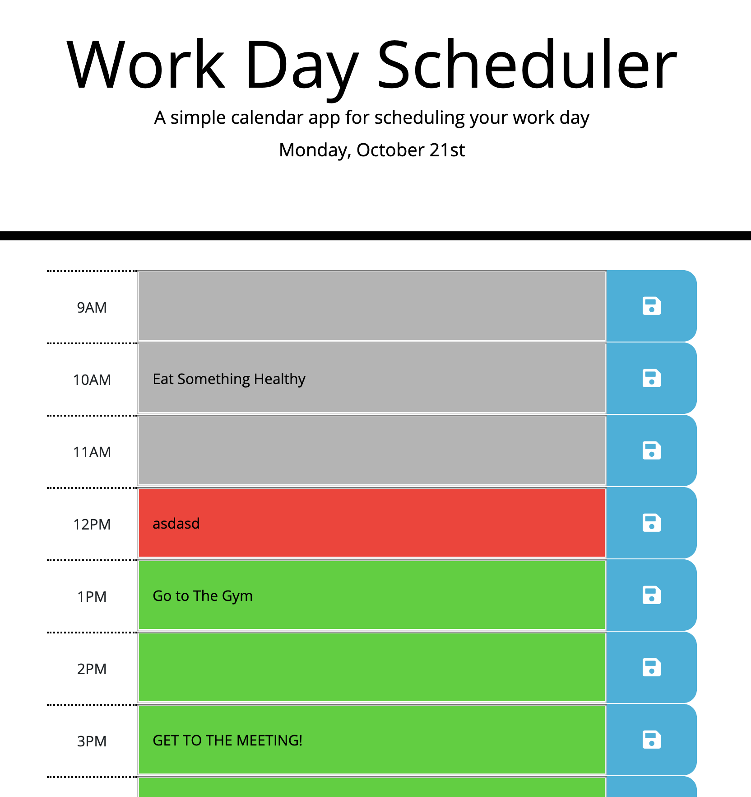

# Day Planner!

This is a simple app that lets you keep track of your daily tasks.

All your taks will get saved on your local storage and you can access it no matter when.

The time blocks will be green at the start of the day.
As time passes the the time blocks, they change colors to indicate the time of the day:

For example: if it is currently 12PM, then the block of time at 12PM will be "RED", all of the passed time blocks will be "GRAY" and all the upcoming timeblocks will be "GREEN"

Enjoy! 
